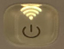
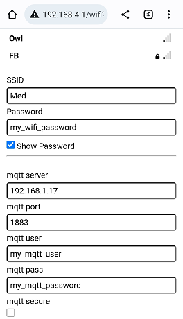
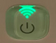

## Smart plug, manufacturer agnostic BLE gateway and energy meter in one device.

[**Theengs Plug**](https://shop.theengs.io/products/theengs-plug-smart-plug-ble-gateway-and-energy-consumption) connects to an MQTT broker to be controlled and to push Bluetooth Low Energy sensors informations and power consumption. You will find below a quick start guide to have your plug connected to an MQTT broker.

1. Plug the device into an outlet, a steady orange LED will switch ON

  

2. From your smartphone do a Wifi search and look for a Wifi network starting by `OMG_`

  

3. Click on this network and enter the 8 last digits of the device MAC address, the device MAC address is printed on the side of it.
Example for a MAC address `409151234678` the Wifi password will be `51234678`
4. Depending on your smartphone a webpage will popup, if it doesn't pop up, click on the gear at the right of the Wifi network 

  

1. and click on "Manage router"

  

::: tip
If your smartphone disconnects from the plug Wifi network and reconnects automaticaly to your main Wifi, you can click on your main Wifi and choose "forget".
This will keep the connection to the plug stable to reach the configuration. Once the configuration is done you can reconnect your smartphone to your main Wifi.
Also if the plug is connected, and you are not seeing the configuration portal, you can access it through the web browser and the following ip address `192.168.4.1`
:::

5. The web page will appear, click on "Configure Wifi"

  

6. Enter the following parameters:
* Select your Wifi Access Point (SSID) - compulsory
* Enter your wifi password (Password) - compulsory
* Enter your mqtt server - compulsory
* Enter your mqtt port - compulsory

The following parameters are optional or can be kept as proposed:
* Enter your mqtt user - optional
* Enter your mqtt password - optional
* Select if your broker requires a secure connection, if yes you will need to copy and paste the certificates on the next fields
* Modify the gateway name if you need
* Modify the base topic if you need
* Change the Over The Air (OTA) password if you need

  

7. Click on Save

Once connected properly the gateway LED should be green and blink blue when scanning.

  

To use and integrate the plug with an Home Automation Controller you can switch to [OpenMQTTGateway documentation](https://docs.openmqttgateway.com/use/ble.html)

::: tip
To reset the parameters you can do a long button press >30s until your reach a steady orange led. Once done, the Theengs Plug will generate the Wifi configuration portal (step 2).
:::

If you are encountering issue with the plug, you can contact the support at the following email: [florian@theengs.io](mailto:florian@theengs.io)