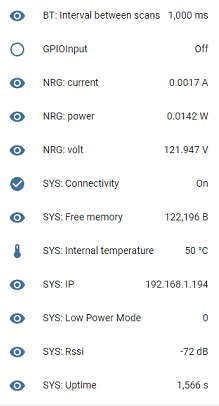
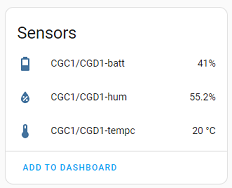
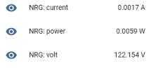

# LED status

## Steady orange
The plug generated an Access Point for onboarding on a network
<p align="left">
  
</p>

## Orange 5 seconds, off 5 seconds
The plug is disconnected from the MQTT broker

## Orange 2 seconds, off 2 seconds
The plug is disconnected from the Wifi broker

## Steady green
The plug is connected to the network and MQTT broker
<p align="left">
  
</p>

## Steady blue
An update or an operation is in progress
<p align="left">
  
</p>

## Flashing blue
Scan or communication in progress

## Steady red for the power Led
An overcurrent has been detected. The relay has been switched Off automatically
<p align="left">
  
</p>

# Modules and parameters

## Home Assistant discovery convention
The plug publishes its configuration and the detected BLE sensors to the broker following [Home Assistant discovery convention](https://www.home-assistant.io/integrations/mqtt/#mqtt-discovery). You will find the devices into Configuration->Devices menu with [Home Assistant](https://docs.openmqttgateway.com/integrate/home_assistant.html)

<p align="left">
  
</p>

<p align="left">
  
</p>

::: tip
The Home Assistant convention can also be used by other controllers to leverage automatic discovery.
:::

## Bluetooth gateway
These [Bluetooth devices](https://docs.openmqttgateway.com/prerequisites/devices.html#for-ble-devices) will be detected, and their data will be published to the MQTT broker.
```
home/112233445566/BTtoMQTT/AABBCCDDEEFF
{"id":"AA:BB:CC:DD:EE:FF","rssi":-88,"brand":"ClearGrass/Qingping","model":"Alarm Clock","model_id":"CGC1/CGD1","tempc":20.3,"tempf":68.54,"hum":55.3,"batt":41}
```
For example with auto-discovery
<p align="left">
  
</p>

## RN8209 sensor 
The plug will report voltage, current and power to the MQTT broker.
```
home/112233445566/RN8209toMQTT
{"volt":121,"current":1,"power":121}
```

For example with auto-discovery
<p align="left">
  
</p>

## Actuator ONOFF
You can control the relay with an MQTT command or with the button (if the plug is connected to an MQTT broker)

Switch ON
```
home/C8F09EB61A44/commands/MQTTtoONOFF
{"cmd":1}
```
Switch OFF
```
home/C8F09EB61A44/commands/MQTTtoONOFF
{"cmd":1}
```

## Sensor GPIO
You can get notified with a press of the button
```
home/112233445566/GPIOInputtoMQTT
{"gpio":"LOW"}
```

## Default parameters
* BLE Time between scans: 100ms
* BLE Scan duration: 3000ms
* Connect to BLE devices deactivated
* BLE Active scan activated
* Max current that switch Off the relay: 15A

The BLE parameters can be changed with the commands detailed into [BLE gateway usage](https://docs.openmqttgateway.com/use/ble.html).

# Updating Theengs Plug
Theengs plug can benefit from Over The Air updates following these different methods:
* From the WifiManager portal, by uploading a binary directly to the plug
* From platformio if the plug is connected to the same Wifi as the programming computer
* From an MQTT command to trigger the download of the firmware from a webserver

