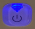

# LED status

## Steady orange
The plug generated an Access Point for onboarding on a network

  

## Orange 5 seconds, off 5 seconds
The plug is disconnected from the MQTT broker

## Orange 2 seconds, off 2 seconds
The plug is disconnected from the Wifi broker

## Steady green
The plug is connected to the network and MQTT broker

  

## Steady blue
An update or an operation is in progress

  

## Flashing blue
Scan or communication in progress

